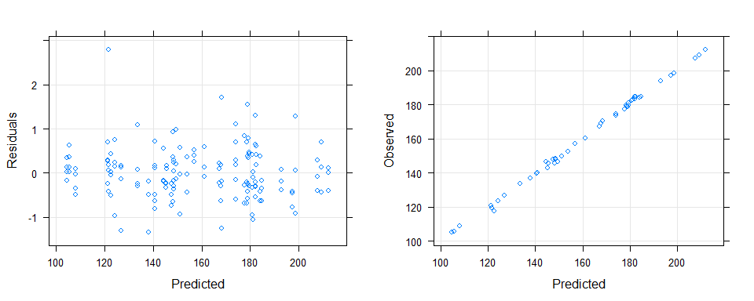

============================================================
============================================================

## Synopsis

Our goal was to find publicly available data for key demand-supply factors that influence US home prices, and to build a data science model which explained how these factors influenced home prices over the last 20 years.

We started by extracting data for US home prices and 13 demand-supply factors, which we integrated into 1 dataset. We divided this dataset into training (60%), validation (20%), and test sets (20%). After data pre-processing, we shortlisted a few machine learning models based on our requirements (high accuracy & interpretability), and measured their performance on the validation set.

The Cubist model gave us the best validation set performance. We selected it as our final model after a thorough evaluation, and then measured test set performance, which was satisfactory. We also performed a variable importance analysis on the final model and 2 other models. Construction spending emerged as the most important factor. Other important factors included consumption, government spending and the unemployment rate.   


============================================================
============================================================

## Dataset & Variable Characteristics

### 1. Data Extraction & Conversion to Processed Data

We extracted data on important supply-demand factors which influence home prices in the US, then merged the data into a single dataset. The code and a more detailed explanation can be found in **Appendix - Section 1**.

Our data sources were as follows:

1. CPI: https://fred.stlouisfed.org/series/CPIAUCSL
2. Unemployment Rate: https://fred.stlouisfed.org/series/UNRATE
3. Federal Funds Rate: https://fred.stlouisfed.org/series/FEDFUNDS
4. Consumer Opinion Surveys: Confidence Indicators: https://fred.stlouisfed.org/series/CSCICP03USM665S
5. Monthly Supply Of Houses: https://fred.stlouisfed.org/series/MSACSR
6. New One Family Houses Sold: https://fred.stlouisfed.org/series/HSN1F
7. Mortgage Rate – 30-Year Fixed: https://fred.stlouisfed.org/series/MORTGAGE30US
8. Personal Consumption Expenditure: https://fred.stlouisfed.org/series/PCE
9. Gross Private Domestic Investment: https://fred.stlouisfed.org/series/GPDI
10. Federal Government: Current Expenditures: https://fred.stlouisfed.org/series/FGEXPND
11. Working Age Population: Aged 15-64: All Persons for the United States: https://fred.stlouisfed.org/series/LFWA64TTUSM647S
12. Housing Credit Availability Index: https://www.urban.org/policy-centers/housing-finance-policy-center/projects/housing-credit-availability-index
13. Total Construction Spending: https://fred.stlouisfed.org/series/TTLCONS

Our response variable is the US Home Price Index. The data is procured from https://fred.stlouisfed.org/series/CSUSHPISA

***

### 2. Processed Dataset Details

The dataset has `249` observations and `18` variables. Apart from 4 frequency variables (`DATE`, `YEAR`, `QUARTER`, `MONTH`), it has the following measures:

1. `CPI`: The **Consumer Price Index** is a measure of the average monthly change in the price for goods and services paid by urban consumers. It is used to recognize periods of inflation and deflation.

2. `UNEMPLOYMENT`: The **Unemployment Rate** represents the number of unemployed as a percentage of the labor force.

3. `FED_RATE`: The **Federal Funds Rate** is the central interest rate in the U.S. financial market. It indirectly influences longer- term interest rates such as mortgages, loans, and savings.

4. `SENTIMENT`: This **Consumer Confidence Indicator** provides an indication of future developments of households’ consumption and saving, based upon answers regarding their expected financial situation, their sentiment about the general economic situation, unemployment and capability of savings. An indicator above 100 signals a boost in the consumers’ confidence towards the future economic situation, and vice versa.

5. `SUPPLY`: The **Months' Supply** is the ratio of houses for sale to houses sold. This statistic provides an indication of the size of the for-sale inventory in relation to the number of houses currently being sold. 

6. `HOUSE_SALES`: The **Number of One Family Houses Sold** every month. The is the main indicator of housing demand. 

7. `CONSUMPTION`: The monthly **Personal Consumption Expenditure** is the largest component of economic growth.

8. `WORKING_AGE_POP`: The **Working Age Population** estimates the total population of people aged 15-64 in the US.

9. `CONSTRUCTION SPEND`: The monthly **Constructuion Spend** in the US. An important economic indicator of housing demand.

10. `MORTGAGE_RATE`: The **30-Year Fixed Rate Mortgage Average** in the United States. A fixed-rate mortgage is a loan where the interest rate remains the same through the term of the loan.

11. `INVESTMENT`: The **Gross Private Domestic Investment (GPDI)** is a measure of the amount of money that domestic businesses invest within their own country, and is one of the components of the GDP.

12. `GOVT_SPEND`: The **Federal Government Current Expenditures** measures government spending, one of the components of the GDP.

13. `HCAI`: The **Housing Credit Availability Index** measures the percentage of owner-occupied home purchase loans that are likely to default. A lower HCAI indicates that lenders are unwilling to tolerate defaults and are imposing tighter lending standards, making it harder to get a loan.

14. `HPI`: The Case-Shiller **Home Price Index** is the leading measure of U.S. residential real estate prices, tracking changes in the value of residential real estate nationally. Our *response variable*.

The following table provides relevant details about each of the above measurements.


```r
#read and display a pre-prepared table that provides dataset details
library(xlsx)
library(kableExtra)

factorDetails <- read.xlsx("FactorDetails.xlsx", sheetIndex = 1) 

knitr::kable(
        factorDetails,
        align = "cccccc"
        ) %>%
        kable_styling(full_width = TRUE)
```

<table class="table" style="margin-left: auto; margin-right: auto;">
 <thead>
  <tr>
   <th style="text-align:center;"> Variable </th>
   <th style="text-align:center;"> Factor </th>
   <th style="text-align:center;"> Source </th>
   <th style="text-align:center;"> Units </th>
   <th style="text-align:center;"> Frequency </th>
   <th style="text-align:center;"> Season_Adjust </th>
  </tr>
 </thead>
<tbody>
  <tr>
   <td style="text-align:center;"> CPI </td>
   <td style="text-align:center;"> Consumer Price Index for all Urban Customers </td>
   <td style="text-align:center;"> US Bureau of Labour Statistics </td>
   <td style="text-align:center;"> Index (1982-1984=100) </td>
   <td style="text-align:center;"> Monthly </td>
   <td style="text-align:center;"> Yes </td>
  </tr>
  <tr>
   <td style="text-align:center;"> UNEMPLOYMENT </td>
   <td style="text-align:center;"> Unemployment Rate </td>
   <td style="text-align:center;"> US Bureau of Labour Statistics </td>
   <td style="text-align:center;"> Percent </td>
   <td style="text-align:center;"> Monthly </td>
   <td style="text-align:center;"> Yes </td>
  </tr>
  <tr>
   <td style="text-align:center;"> FED_RATE </td>
   <td style="text-align:center;"> Federal Funds Rate </td>
   <td style="text-align:center;"> Board of Governors, Fed </td>
   <td style="text-align:center;"> Percent </td>
   <td style="text-align:center;"> Monthly </td>
   <td style="text-align:center;"> No </td>
  </tr>
  <tr>
   <td style="text-align:center;"> SENTIMENT </td>
   <td style="text-align:center;"> Consumer Opinion Surveys: Confidence Indicators </td>
   <td style="text-align:center;"> OECD </td>
   <td style="text-align:center;"> Numeric Index </td>
   <td style="text-align:center;"> Monthly </td>
   <td style="text-align:center;"> Yes </td>
  </tr>
  <tr>
   <td style="text-align:center;"> SUPPLY </td>
   <td style="text-align:center;"> Monthly Supply of Houses </td>
   <td style="text-align:center;"> U.S. Census Bureau &amp; HUD </td>
   <td style="text-align:center;"> Ratio (Houses for Sale / Houses Sold) </td>
   <td style="text-align:center;"> Monthly </td>
   <td style="text-align:center;"> Yes </td>
  </tr>
  <tr>
   <td style="text-align:center;"> HOUSE_SALES </td>
   <td style="text-align:center;"> New One Family Houses Sold </td>
   <td style="text-align:center;"> U.S. Census Bureau &amp; HUD </td>
   <td style="text-align:center;"> Thousands of Houses </td>
   <td style="text-align:center;"> Monthly </td>
   <td style="text-align:center;"> Yes </td>
  </tr>
  <tr>
   <td style="text-align:center;"> CONSUMPTION </td>
   <td style="text-align:center;"> Personal Consumption Expenditure </td>
   <td style="text-align:center;"> U.S. Bureau of Economic Analysis </td>
   <td style="text-align:center;"> Billions of Dollars </td>
   <td style="text-align:center;"> Monthly </td>
   <td style="text-align:center;"> Yes </td>
  </tr>
  <tr>
   <td style="text-align:center;"> WORKING_AGE_POP </td>
   <td style="text-align:center;"> Working Age Population: Aged 15-64 </td>
   <td style="text-align:center;"> OECD </td>
   <td style="text-align:center;"> Millions of Persons </td>
   <td style="text-align:center;"> Monthly </td>
   <td style="text-align:center;"> Yes </td>
  </tr>
  <tr>
   <td style="text-align:center;"> CONSTRUCTION_SPEND </td>
   <td style="text-align:center;"> Total Construction Spending </td>
   <td style="text-align:center;"> U.S. Census Bureau </td>
   <td style="text-align:center;"> Billions of Dollars </td>
   <td style="text-align:center;"> Monthly </td>
   <td style="text-align:center;"> Yes </td>
  </tr>
  <tr>
   <td style="text-align:center;"> MORTGAGE_RATE </td>
   <td style="text-align:center;"> Mortgage Rate - 30-Year Fixed </td>
   <td style="text-align:center;"> Freddie Mac </td>
   <td style="text-align:center;"> Percent </td>
   <td style="text-align:center;"> Monthly </td>
   <td style="text-align:center;"> No </td>
  </tr>
  <tr>
   <td style="text-align:center;"> INVESTMENT </td>
   <td style="text-align:center;"> Gross Private Domestic Investment </td>
   <td style="text-align:center;"> U.S. Bureau of Economic Analysis </td>
   <td style="text-align:center;"> Billions of Dollars </td>
   <td style="text-align:center;"> Monthly (coerced from Quarterly) </td>
   <td style="text-align:center;"> Yes </td>
  </tr>
  <tr>
   <td style="text-align:center;"> GOVT_SPEND </td>
   <td style="text-align:center;"> Federal Government: Current Expenditures </td>
   <td style="text-align:center;"> U.S. Bureau of Economic Analysis </td>
   <td style="text-align:center;"> Billions of Dollars </td>
   <td style="text-align:center;"> Monthly (coerced from Quarterly) </td>
   <td style="text-align:center;"> Yes </td>
  </tr>
  <tr>
   <td style="text-align:center;"> HCAI </td>
   <td style="text-align:center;"> Housing Credit Availability Index </td>
   <td style="text-align:center;"> Urban Institute </td>
   <td style="text-align:center;"> Percent </td>
   <td style="text-align:center;"> Monthly (coerced from Quarterly) </td>
   <td style="text-align:center;"> No </td>
  </tr>
  <tr>
   <td style="text-align:center;"> HPI </td>
   <td style="text-align:center;"> US National Home Price Index </td>
   <td style="text-align:center;"> S&amp;P Dow Jones Indices LLC </td>
   <td style="text-align:center;"> Index (Jan 2000=100) </td>
   <td style="text-align:center;"> Monthly </td>
   <td style="text-align:center;"> Yes </td>
  </tr>
</tbody>
</table>

A few notes on the dataset:

* Our data spans from **January 2000 to September 2020** - a total of 249 observations.

* Most of our variables, including the response `HPI`, are **seasonally adjusted**. The exceptions: `FED_RATE`, `MORTGAGE_RATE`, and `HCAI`. 

* Most of our variables were available as a **monthly measurement**. However, `INVESTMENT`, `GOVT_SPEND`, and `HPI` were quarterly measurements. We made the assumption that all 3 measures would be the same for each month in the quarter. Thus, we divided each `INVESTMENT` and `GOVT_SPEND` observation by 3, and replicated the `HCAI` measurement for each month in the quarter.

* The overall GDP was only available as a quarterly measurement. `CONSUMPTION`, the biggest component of GDP, was available as a monthly measurement. Therefore, we decided to extract individual GDP components - `CONSUMPTION`, `INVESTMENT`, and `GOVT_SPEND` (we decided to ignore Net Exports). 

***

### 3. Variable Trends

We can view the 20-year trends for each variable below. 


```r
#save histograms of all factors
library(ggplot2)

p1 <- ggplot(hpFactors, aes(DATE, HPI)) +
        geom_line(size = 1.5, colour = "blue")
p2 <- ggplot(hpFactors, aes(DATE, CPI)) +
        geom_line(size = 1.5)
p3 <- ggplot(hpFactors, aes(DATE, UNEMPLOYMENT)) +
        geom_line(size = 1.5)
p4 <- ggplot(hpFactors, aes(DATE, FED_RATE)) +
        geom_line(size = 1.5)
p5 <- ggplot(hpFactors, aes(DATE, SUPPLY)) +
        geom_line(size = 1.5)
p6 <- ggplot(hpFactors, aes(DATE, HOUSE_SALES)) +
        geom_line(size = 1.5)
p7 <- ggplot(hpFactors, aes(DATE, SENTIMENT)) +
        geom_line(size = 1.5)
p8 <- ggplot(hpFactors, aes(DATE, CONSUMPTION)) +
        geom_line(size = 1.5)
p9 <- ggplot(hpFactors, aes(DATE, WORKING_AGE_POP)) +
        geom_line(size = 1.5)
p10 <- ggplot(hpFactors, aes(DATE, CONSTRUCTION_SPEND)) +
        geom_line(size = 1.5)
p11 <- ggplot(hpFactors, aes(DATE, MORTGAGE_RATE)) +
        geom_line(size = 1.5)
p12 <- ggplot(hpFactors, aes(DATE, INVESTMENT)) +
        geom_line(size = 1.5)
p13 <- ggplot(hpFactors, aes(DATE, GOVT_SPEND)) +
        geom_line(size = 1.5)
p14 <- ggplot(hpFactors, aes(DATE, HCAI)) +
        geom_line(size = 1.5)

#use the grid.arrange() function to display all variable trends
library(gridExtra)
grid.arrange(p1, p2, p3, p4, p5, p6, p7, p8, p9, 
             p10, p11, p12, p13, p14, nrow = 5)
```


We see that `CPI`, `CONSUMPTION`, and `WORKING_AGE_POP` show similar increases, while the `HPI`, `CONSTRUCTION_SPEND`, and `HOUSE_SALES` variables show similar undulations. `MORTGAGE_RATE` and `HCAI` show a decreasing trend. 

============================================================
============================================================

## Data Pre-processing

### 1. Loading Important Packages

We loaded in the $tidyverse$ set of packages for more efficient coding. We also loaded in the $caret$ and $ModelMetrics$ packages for data modeling purposes.   


```r
library(tidyverse)
library(caret)
library(ModelMetrics)
```

***

### 2. Dataset Manipulations

We removed the frequency variables (`DATE`, `YEAR`, `QUARTER`, `MONTH`) from our dataset, and rearranged the variables so that the response variable is at the end. We now had a total of `249` observations and `14` variables.


```r
hpFactorsNeo <- as.data.frame(hpFactors)
hpFactorsNeo <- hpFactorsNeo %>%
        select(CPI:HCAI, HPI)
```

***

### 3. Training, Validation and Test Sets

We created the Training, Validation, and Testing sets with 60%, 20% and 20% of the overall data, respectively. The aim was to:

* Have enough training set observations to approximate the true underlying model
* Have enough test and validation set observations so that outliers do not affect our model performance
* Use the validation set RMSE to select the final model
* Use the test set RMSE to compute final model performance 


```r
set.seed(100)

#divide dataset into training-validation & test sets
trainingCutoff <- createDataPartition(hpFactorsNeo$HPI, p = 0.8, list = FALSE)
trainingCutoff <- as.vector(trainingCutoff)
trainValidation <- hpFactorsNeo[trainingCutoff,]
testing <- hpFactorsNeo[-trainingCutoff,] 

#divide training-validation set into training and validation sets 
validationCutoff <- createDataPartition(trainValidation$HPI, p = 0.75, 
                                        list = FALSE)
validationCutoff <- as.vector(validationCutoff)
training <- trainValidation[validationCutoff,]
validation <- trainValidation[-validationCutoff,]
```

We ended up with 153 observations in the training set, and 48 observations each in the validation and test sets.

***

### 4. Dealing with Collinearity

Our variable trends plot indicated high correlation between multiple variables. We used the $corrplot()$ function to visualize the correlation plot.


```r
#compute between-predictor correlations
correlations <- cor(training[,1:(length(training) - 1)])

#visualize correlations between predictors
library(corrplot)
corrplot(correlations, order = "hclust", tl.cex = 0.65, tl.col = "black")
```


`CONSUMPTION`, `WORKING_AGE_POP` and `CPI` have high positive correlation with each other, and high negative correlation with `MORTGAGE_RATE` and `HCAI`.

We removed one of each pair of highly correlated variables using the $findCorrelation()$ function - `WORKING_AGE_POP` and `CPI` were the two variables removed. 


```r
#compute variables with absolute correlation > 0.95
high <- findCorrelation(correlations, cutoff = 0.95, exact = TRUE)
highNames <- findCorrelation(correlations, cutoff = 0.95, names = TRUE)

#remove highly correlated predictors
training <- training[,-(high)]

#view discarded variables
highNames
```

```
[1] "WORKING_AGE_POP" "CPI"            
```

```r
#view remaining dataset variables
colnames(training)
```

```
 [1] "UNEMPLOYMENT"       "FED_RATE"           "SENTIMENT"         
 [4] "SUPPLY"             "HOUSE_SALES"        "CONSUMPTION"       
 [7] "CONSTRUCTION_SPEND" "MORTGAGE_RATE"      "INVESTMENT"        
[10] "GOVT_SPEND"         "HCAI"               "HPI"               
```

Thus, we now have a total of 153 variables in the dataset - 11 predictors and 1 response.

***

### 5. Reducing Skewness 

We used the $skewness()$ function to find which predictors had a skewed distribution. An absolute value greater than 1 indicates high skew. `UNEMPLOYMENT`, `FED_RATE`, `SUPPLY`, and `GOVT_SPEND` had high skewness. 

Another indicator of skewness is the ratio of highest to lowest value. An absolute value greater than 20 indicates a highly skewed distribution. The `FED_RATE` variable showed high skewness.

We decided to use the **Box-Cox Transformation** during model training in order to mitigate this issue.


```r
#skewness - skewness() function
library(e1071)
skewValues <- apply(training, 2, skewness)
skewValues[abs(skewValues) > 1] 
```

```
UNEMPLOYMENT     FED_RATE       SUPPLY   GOVT_SPEND 
    1.253419     1.224851     1.365107     1.567828 
```

```r
#skewness - ratio: max/min
skewRatio <- apply(training, 2, function(x) max(abs(x))/min(abs(x)))
skewRatio[skewRatio > 20] 
```

```
FED_RATE 
   130.6 
```

***

### 6. Validation & Test Set Preprocessing

Finally, we applied the same pre-processing steps on the validation and test sets.


```r
validation <- validation[,-(high)]
testing <- testing[,-(high)]
```

============================================================
============================================================

## Model Selection

### 1. Model Selection Considerations

We decided to select models based on the following considerations and assumptions:

* We desired **high model accuracy**, but we also wanted to know **which factors influenced house prices**.

* The **high correlation between predictors** (even after removing 2 predictors) indicated that standard linear regression models might suffer due to high variance. However, penalised linear models might reduce variance and improve model performance.

* **Feature extraction techniques** such as Principle Component Analysis (PCA) and Partial Least Squares (PLS) might mitigate collinearity issues and reduce model variance.

* **Tree-based models** and **Support Vector Machines (SVM)** are not influenced by outlier observations, and usually provide high accuracy.

* We used **RMSE** (Root Mean Squared Error) as our model accuracy measure. The RMSE can be interpreted as the average distance between the observed values and the model predictions.

* We used the $varImp()$ function to indicate which variables had the most influence on our models.

***

### 2. Shortlisted Models

1. Elastic Net
2. Elastic Net with PCA pre-processing
3. Partial Least Squares (PLS)
4. Multivariate Adaptive Regression Splines (MARS)
5. Support Vector Machines
6. K Nearest Neighbours
7. Bagging
8. Random Forest
9. Cubist

***

### 3. Selecting Pre-Processing Options & Cross Validation Techniques

We performed Box-Cox Transformation on all the predictors to remove skewness, and Centered and Scaled each predictor. For models using PCA feature extraction, PCA pre-processing was also performed.

Given the fact that our training set sample size is relatively small, we went for rigorous **repeated cross validation (5 times) using 10 folds**.


```r
#setting the 'preProcess' and 'trainControl' arguments
ctrl <- trainControl(method = "repeatedcv", number = 10, repeats = 5)
ctrlPCA <- trainControl(method = "repeatedcv", number = 10, repeats = 5,
                        preProcOptions = list(thresh = 0.95))

BoxCenterScale <- c("BoxCox", "center", "scale")
BoxCenterScalePCA <- c("BoxCox", "center", "scale", "pca")
```

***

### 4. Model Performance Comparison

For each shortlisted method, we first set the seed, then trained the model using the above pre-processing and cross validation options. We then computed the validation set RMSE for each model. (Please refer to **Appendix - Section 2** for the code.)


```
note: only 10 unique complexity parameters in default grid. Truncating the grid to 10 .
```

Once we computed all the validation set RMSEs, we captured them along with the model names in a data frame, and plotted them.


```r
#create a data frame which captures each model and its validation set RMSE
rmseDF <- data.frame(Model = c("PLS", "ElasticNet", "ElasticNet_PCA", "MARS", 
                               "SVM", "KNN", "Bagging", 
                               "RandomForest", "Cubist"),
                     ValidationRMSE = c(plsValRMSE, elasticValRMSE, elasticValPCA_RMSE, 
                                         marsValRMSE, svmValRMSE, knnValRMSE, 
                                         bagValRMSE, rfValRMSE, cubistValRMSE))

#plot the validation set RMSEs of each model
ggplot(rmseDF, aes(Model, ValidationRMSE)) +
        geom_segment(aes(xend = Model), yend = 0, colour = "grey50") +
        geom_point(size = 3, colour = "red") +
        theme(panel.grid.major.x = element_blank()) +
        ylim(0.27,6) +
        coord_flip() +
        labs(title = "Validation RMSE of Shortlisted Models",
             subtitle = "Random Forest & Cubist have lowest RMSE", 
             y = "Validation RMSE",
             x = "Model")
```

<!-- -->

**Cubist** and **Random Forest** have the lowest validation set RMSEs, followed by **K Nearest Neighbours**. To find out which model had the lowest RMSE, we looked at the data.


```r
knitr::kable(
        rmseDF,
        align = "lc"
        ) %>%
        kable_styling(full_width = FALSE)
```

<table class="table" style="width: auto !important; margin-left: auto; margin-right: auto;">
 <thead>
  <tr>
   <th style="text-align:left;"> Model </th>
   <th style="text-align:center;"> ValidationRMSE </th>
  </tr>
 </thead>
<tbody>
  <tr>
   <td style="text-align:left;"> PLS </td>
   <td style="text-align:center;"> 2.912669 </td>
  </tr>
  <tr>
   <td style="text-align:left;"> ElasticNet </td>
   <td style="text-align:center;"> 2.881211 </td>
  </tr>
  <tr>
   <td style="text-align:left;"> ElasticNet_PCA </td>
   <td style="text-align:center;"> 5.067572 </td>
  </tr>
  <tr>
   <td style="text-align:left;"> MARS </td>
   <td style="text-align:center;"> 2.279088 </td>
  </tr>
  <tr>
   <td style="text-align:left;"> SVM </td>
   <td style="text-align:center;"> 2.813708 </td>
  </tr>
  <tr>
   <td style="text-align:left;"> KNN </td>
   <td style="text-align:center;"> 1.875582 </td>
  </tr>
  <tr>
   <td style="text-align:left;"> Bagging </td>
   <td style="text-align:center;"> 4.187620 </td>
  </tr>
  <tr>
   <td style="text-align:left;"> RandomForest </td>
   <td style="text-align:center;"> 1.385873 </td>
  </tr>
  <tr>
   <td style="text-align:left;"> Cubist </td>
   <td style="text-align:center;"> 1.363391 </td>
  </tr>
</tbody>
</table>

**Cubist** had the lowest validation set RMSE @ 1.36, followed by **Random Forest** @ 1.38.

**Based on the RMSE, we select Cubist as our final model.**

============================================================
============================================================

## Final Model: Cubist

### 1. Model Definition

Cubist models are a form of decision tree modeling that makes use of rules to subset the data. The primary algorithm contains two steps. The first step establishes a set of rules that divides the data into smaller subsets. The second part of the algorithm that applies a regression model to these smaller subsets to arrive at a prediction.

The predictions can be further augmented through the use of **neighbor** and **committee** aspects of the model. The neighbor function will apply a nearest neighbor algorithm to the leaf node and then use an ensemble approach combining the cubist prediction with the nearest neighbor prediction to arrive at a final output. The average prediction that is used in a decision tree is replaced with a regression model at the leaf node. The committee function has a similar benefit to boosting. The first cubist model makes a prediction and subsequent cubist models attempt to adjust for the errors made in the prior models.

According to [Open Data Science](https://medium.com/@ODSC/balancing-interpretability-and-predictive-power-with-cubist-models-in-r-858d2c936b79#id_token=eyJhbGciOiJSUzI1NiIsImtpZCI6IjAzYjJkMjJjMmZlY2Y4NzNlZDE5ZTViOGNmNzA0YWZiN2UyZWQ0YmUiLCJ0eXAiOiJKV1QifQ.eyJpc3MiOiJodHRwczovL2FjY291bnRzLmdvb2dsZS5jb20iLCJuYmYiOjE2MTIzMDA5NzMsImF1ZCI6IjIxNjI5NjAzNTgzNC1rMWs2cWUwNjBzMnRwMmEyamFtNGxqZGNtczAwc3R0Zy5hcHBzLmdvb2dsZXVzZXJjb250ZW50LmNvbSIsInN1YiI6IjExNDg1OTc0MTUyOTQyNjc0MzAwOCIsImVtYWlsIjoiZ29vbmVyLnNpZGRodW9yYW1hQGdtYWlsLmNvbSIsImVtYWlsX3ZlcmlmaWVkIjp0cnVlLCJhenAiOiIyMTYyOTYwMzU4MzQtazFrNnFlMDYwczJ0cDJhMmphbTRsamRjbXMwMHN0dGcuYXBwcy5nb29nbGV1c2VyY29udGVudC5jb20iLCJuYW1lIjoiU2lkZGhhcnRoIFNhbWFudCIsInBpY3R1cmUiOiJodHRwczovL2xoMy5nb29nbGV1c2VyY29udGVudC5jb20vYS0vQU9oMTRHaVo0eHRIWEVQZkF5dFYtT0Qxdld6cENJZGlKLVBCSzVIdFBPcHk9czk2LWMiLCJnaXZlbl9uYW1lIjoiU2lkZGhhcnRoIiwiZmFtaWx5X25hbWUiOiJTYW1hbnQiLCJpYXQiOjE2MTIzMDEyNzMsImV4cCI6MTYxMjMwNDg3MywianRpIjoiNjgwY2JiNjhiZmMwYTllMTliMjNiMDJlMWZiZDEzZGFlMWE5NTRkOSJ9.ElPk9SI6hSBY-KgyfIGXP_4OkZEqgkQ6stcqHZSsxA6WtwODykbrSv0iPkO-yqJVoCUz-tgF_0F8x52SlSqxALOnSqYuxFIukSFYx7Hu8Ixjgvr9_bmtquTBuobVZf7HzsFZDMUa5fSKqvCGRHEAsHGw6fWXwI2pYnUjaXESG7GjauMYhIrl_u1w3KvzsYExHqQ89yuWXZmlma_JqPwowVmCKYcea7LRdt_4COx4t1HzT5gvNS-Sa9Clb-Ph2_br4uGh49dV17zu-F2EniXa3UieHYvs0aTaCrN-POLAugNODj2fCXULDJGfHIL-SKDuWNkgAH8rKadJ61m-jj192Q), Cubist models balance interpretability and predictive power.

***

### 2. Residual Analysis

The residual plots of both the training and validation sets do not display anything untoward. The rare outlier is within the normal range. Similarly, the predicted and actual values are very close to each other, with no systematic under- or over-prediction issue.

**Training Set - Residual Plots:**

```r
#residual plot - training set
x1 <- xyplot(resid(cubistFit) ~ predict(cubistFit),
       type = c("p", "g"),
       xlab = "Predicted", ylab = "Residuals")

#predicted vs. actual values
x2 <- xyplot(training$HPI ~ predict(cubistFit),
       type = c("p", "g"),
       xlab = "Predicted", ylab = "Observed")

#residual plots
grid.arrange(x1, x2, nrow = 1)
```


**Validation Set - Residual Plots:**

```r
#residual plot - validation set
x3 <- xyplot(resid(cubistFit, validation) ~ predict(cubistFit, validation),
       type = c("p", "g"),
       xlab = "Predicted", ylab = "Residuals")

#predicted vs. actual values
x4 <- xyplot(validation$HPI ~ predict(cubistFit, validation),
       type = c("p", "g"),
       xlab = "Predicted", ylab = "Observed")

#residual plots
grid.arrange(x3, x4, nrow = 1)
```



***

### 3. Final Model Parameters

Our model tunes over 3 committee values  & 3 neighbour values using repeated cross validation. **The final model chooses 20 committees and 5 neighbours.**


```r
#view the final model parameters
cubistFit
```

```
Cubist 

153 samples
 11 predictor

Pre-processing: Box-Cox transformation (11), centered (11), scaled (11) 
Resampling: Cross-Validated (10 fold, repeated 5 times) 
Summary of sample sizes: 138, 138, 138, 137, 138, 138, ... 
Resampling results across tuning parameters:

  committees  neighbors  RMSE      Rsquared   MAE     
   1          0          2.394109  0.9935178  1.577430
   1          5          2.245305  0.9940961  1.452251
   1          9          2.307146  0.9939395  1.509594
  10          0          1.770324  0.9966560  1.253233
  10          5          1.682660  0.9968652  1.139805
  10          9          1.711452  0.9968502  1.188015
  20          0          1.756044  0.9967720  1.236156
  20          5          1.678019  0.9969655  1.125331
  20          9          1.701822  0.9969596  1.168956

RMSE was used to select the optimal model using the smallest value.
The final values used for the model were committees = 20 and neighbors = 5.
```

***

### 4. Important Variables

The $varImp()$ function calculates the variable importance for each model. For the Cubist method, the variable importance reflects all the linear models used in prediction - it is a linear combination of the usage in the rule conditions and the model.  

Let's take a look at the variable importance plot.


```r
plot(varImp(cubistFit), main = "Variable Importance - Cubist Model")
```


**`CONSTRUCTION_SPEND` is the most important variable, followed closely by `UNEMPLOYMENT` and `CONSUMPTION`.** On the other hand, `MORTGAGE_RATE`, `FED_RATE` and `SENTIMENT` have very low variable importance.


Let's compare the important variables of Cubist with the other 2 models with low validation RMSE - Random Forest & K Nearest Neighbours.


```r
#compute variable importance of Cubist, Random Forest & KNN
v1 <- plot(varImp(cubistFit), xlab = "Cubist Model")
v2 <- plot(varImp(rfFit), xlab = "RF Model")
v3 <- plot(varImp(knnFit), xlab = "KNN Model")

#plot & compare variable importance
grid.arrange(v1, v2, v3, nrow = 1)
```


* All 3 models identify `CONSTRUCTION_SPEND` as the most important variable.
* The next important variables on both Random Forest and KNN are `GOVT_SPEND`, `CONSUMPTION`, and `INVESTMENT` - all GDP growth components.
* `CONSUMPTION` and `GOVT_SPEND`are high variable importance factors in our Cubist model too.
* However, `UNEMPLOYMENT`, which is an important Cubist variable, is not an important variable for either RF or KNN models.

**In conclusion:** 
**Construction Spending** is the most important factor for predicting housing prices over the last 20 years. GDP components such as **Consumption** & **Government Spending**, while less important, also help predict housing prices. The **Unemployment Rate** is also an important factor as per our final model.

***

### 5. Test Set Prediction

Finally, we predict the test set using our Cubist model, and compute the RMSE.


```r
cubistTestRMSE <- RMSE(predict(cubistFit, testing), testing$HPI)
cubistTestRMSE
```

```
[1] 1.2855
```

The test set RMSE @ 1.29 is lower than the validation set RMSE @ 1.36. It is also lower than the validation set RMSE of all our shortlisted models.

============================================================
============================================================

## Appendix 

### 1. Importing Raw Data & Creating Processed Dataset

The following steps were taken to create the processed dataset, `hpFactors`, from multiple raw datasets:

1. Each factor was downloaded as a Text File from the data source, and read as a data frame
2. The required transformations were performed on each data frame - for example, the `CONSTRUCTION_SPEND` variable in the `constructionSpending` data frame was converted from USD Millions to USD Billions
3. In addition, date-time transformations were performed on each data frame. This was done for the purposes for joining the data frames into a single dataset
4. All the data frames were then combined into a single dataset using the $left_join()$ function
5. Redundant variables were removed, and the remaining variables were rearranged
6. The `HCAI` variable had 2 missing values (Oct-20 and Nov-20). Since there were a total of 251 observations, and 2/251 < 1%, these 2 observations were removed from the dataset

Thus, finally, we were left with `249` observations and `18` variables.


```r
#load useful packages
library(tidyverse)
library(caret)
library(lubridate)
library(xlsx)

#download home price index - seasonally adjusted
url1 <- "https://fred.stlouisfed.org/graph/fredgraph.csv?bgcolor=%23e1e9f0&chart_type=line&drp=0&fo=open%20sans&graph_bgcolor=%23ffffff&height=450&mode=fred&recession_bars=on&txtcolor=%23444444&ts=12&tts=12&width=1168&nt=0&thu=0&trc=0&show_legend=yes&show_axis_titles=yes&show_tooltip=yes&id=CSUSHPISA&scale=left&cosd=1987-01-01&coed=2020-11-01&line_color=%234572a7&link_values=false&line_style=solid&mark_type=none&mw=3&lw=2&ost=-99999&oet=99999&mma=0&fml=a&fq=Monthly&fam=avg&fgst=lin&fgsnd=2020-02-01&line_index=1&transformation=lin&vintage_date=2021-01-29&revision_date=2021-01-29&nd=1987-01-01"
download.file(url1, destfile = "hpi.csv")
hpi <- read_csv("hpi.csv")

hpi <- hpi %>%
        filter(year(DATE) >= 2000) %>%
        rename(HPI = CSUSHPISA) %>%
        mutate(YEAR = year(DATE),
               QUARTER = quarter(DATE),
               MONTH = month(DATE)) %>%
        select(DATE, YEAR, QUARTER, MONTH, HPI)


#download consumer price index inflation - seasonally adjusted
url2 <- "https://fred.stlouisfed.org/graph/fredgraph.csv?bgcolor=%23e1e9f0&chart_type=line&drp=0&fo=open%20sans&graph_bgcolor=%23ffffff&height=450&mode=fred&recession_bars=on&txtcolor=%23444444&ts=12&tts=12&width=1168&nt=0&thu=0&trc=0&show_legend=yes&show_axis_titles=yes&show_tooltip=yes&id=CPIAUCSL&scale=left&cosd=1947-01-01&coed=2020-12-01&line_color=%234572a7&link_values=false&line_style=solid&mark_type=none&mw=3&lw=2&ost=-99999&oet=99999&mma=0&fml=a&fq=Monthly&fam=avg&fgst=lin&fgsnd=2020-02-01&line_index=1&transformation=lin&vintage_date=2021-01-29&revision_date=2021-01-29&nd=1947-01-01"
download.file(url2, destfile = "cpi.csv")
cpi <- read_csv("cpi.csv")

cpi <- cpi %>%
        filter(year(DATE) >= 2000) %>%
        rename(CPI = CPIAUCSL)


#download unemployment rate - seasonally adjusted
url3 <- "https://fred.stlouisfed.org/graph/fredgraph.csv?bgcolor=%23e1e9f0&chart_type=line&drp=0&fo=open%20sans&graph_bgcolor=%23ffffff&height=450&mode=fred&recession_bars=on&txtcolor=%23444444&ts=12&tts=12&width=1168&nt=0&thu=0&trc=0&show_legend=yes&show_axis_titles=yes&show_tooltip=yes&id=UNRATE&scale=left&cosd=1948-01-01&coed=2020-12-01&line_color=%234572a7&link_values=false&line_style=solid&mark_type=none&mw=3&lw=2&ost=-99999&oet=99999&mma=0&fml=a&fq=Monthly&fam=avg&fgst=lin&fgsnd=2020-02-01&line_index=1&transformation=lin&vintage_date=2021-01-29&revision_date=2021-01-29&nd=1948-01-01"
download.file(url3, destfile = "unemployment.csv")
unemployment <- read_csv("unemployment.csv")

unemployment <- unemployment %>%
        filter(year(DATE) >= 2000) %>%
        rename(UNEMPLOYMENT = UNRATE)


#download federal funds rate - not seasonally adjusted
url4 <- "https://fred.stlouisfed.org/graph/fredgraph.csv?bgcolor=%23e1e9f0&chart_type=line&drp=0&fo=open%20sans&graph_bgcolor=%23ffffff&height=450&mode=fred&recession_bars=on&txtcolor=%23444444&ts=12&tts=12&width=1168&nt=0&thu=0&trc=0&show_legend=yes&show_axis_titles=yes&show_tooltip=yes&id=FEDFUNDS&scale=left&cosd=1954-07-01&coed=2020-12-01&line_color=%234572a7&link_values=false&line_style=solid&mark_type=none&mw=3&lw=2&ost=-99999&oet=99999&mma=0&fml=a&fq=Monthly&fam=avg&fgst=lin&fgsnd=2020-02-01&line_index=1&transformation=lin&vintage_date=2021-01-29&revision_date=2021-01-29&nd=1954-07-01"
download.file(url4, destfile = "ffr.csv")
fedRate <- read_csv("ffr.csv")

fedRate <- fedRate %>%
        filter(year(DATE) >= 2000) %>%
        rename(FED_RATE = FEDFUNDS)


#download consumer confidence index - seasonally adjusted
url5 <- "https://fred.stlouisfed.org/graph/fredgraph.csv?bgcolor=%23e1e9f0&chart_type=line&drp=0&fo=open%20sans&graph_bgcolor=%23ffffff&height=450&mode=fred&recession_bars=on&txtcolor=%23444444&ts=12&tts=12&width=1168&nt=0&thu=0&trc=0&show_legend=yes&show_axis_titles=yes&show_tooltip=yes&id=CSCICP03USM665S&scale=left&cosd=2000-01-01&coed=2020-12-01&line_color=%234572a7&link_values=false&line_style=solid&mark_type=none&mw=3&lw=2&ost=-99999&oet=99999&mma=0&fml=a&fq=Monthly&fam=avg&fgst=lin&fgsnd=2020-02-01&line_index=1&transformation=lin&vintage_date=2021-02-01&revision_date=2021-02-01&nd=1960-01-01"
download.file(url5, destfile = "sentiment.csv")
sentiment <- read_csv("sentiment.csv")

sentiment <- sentiment %>%
        filter(year(DATE) >= 2000) %>%
        rename(SENTIMENT = CSCICP03USM665S)


#download housing supply dataset - seasonally adjusted
url6 <- "https://fred.stlouisfed.org/graph/fredgraph.csv?bgcolor=%23e1e9f0&chart_type=line&drp=0&fo=open%20sans&graph_bgcolor=%23ffffff&height=450&mode=fred&recession_bars=on&txtcolor=%23444444&ts=12&tts=12&width=1168&nt=0&thu=0&trc=0&show_legend=yes&show_axis_titles=yes&show_tooltip=yes&id=MSACSR&scale=left&cosd=1963-01-01&coed=2020-12-01&line_color=%234572a7&link_values=false&line_style=solid&mark_type=none&mw=3&lw=2&ost=-99999&oet=99999&mma=0&fml=a&fq=Monthly&fam=avg&fgst=lin&fgsnd=2020-02-01&line_index=1&transformation=lin&vintage_date=2021-01-29&revision_date=2021-01-29&nd=1963-01-01"
download.file(url6, destfile = "supply.csv")
supply <- read_csv("supply.csv")

supply <- supply %>%
        filter(year(DATE) >= 2000) %>%
        rename(SUPPLY = MSACSR)


#download housing sales dataset - seasonally adjusted
url7 <- "https://fred.stlouisfed.org/graph/fredgraph.csv?bgcolor=%23e1e9f0&chart_type=line&drp=0&fo=open%20sans&graph_bgcolor=%23ffffff&height=450&mode=fred&recession_bars=on&txtcolor=%23444444&ts=12&tts=12&width=1168&nt=0&thu=0&trc=0&show_legend=yes&show_axis_titles=yes&show_tooltip=yes&id=HSN1F&scale=left&cosd=1963-01-01&coed=2020-12-01&line_color=%234572a7&link_values=false&line_style=solid&mark_type=none&mw=3&lw=2&ost=-99999&oet=99999&mma=0&fml=a&fq=Monthly&fam=avg&fgst=lin&fgsnd=2020-02-01&line_index=1&transformation=lin&vintage_date=2021-01-29&revision_date=2021-01-29&nd=1963-01-01"
download.file(url7, destfile = "houseSales.csv")
houseSales <- read_csv("houseSales.csv")

houseSales <- houseSales %>%
        filter(year(DATE) >= 2000) %>%
        rename(HOUSE_SALES = HSN1F)


#download 30-year fixed mortgage rate
url8 <- "https://fred.stlouisfed.org/graph/fredgraph.csv?bgcolor=%23e1e9f0&chart_type=line&drp=0&fo=open%20sans&graph_bgcolor=%23ffffff&height=450&mode=fred&recession_bars=on&txtcolor=%23444444&ts=12&tts=12&width=1168&nt=0&thu=0&trc=0&show_legend=yes&show_axis_titles=yes&show_tooltip=yes&id=MORTGAGE30US&scale=left&cosd=1971-04-02&coed=2021-01-28&line_color=%234572a7&link_values=false&line_style=solid&mark_type=none&mw=3&lw=2&ost=-99999&oet=99999&mma=0&fml=a&fq=Weekly%2C%20Ending%20Thursday&fam=avg&fgst=lin&fgsnd=2020-02-01&line_index=1&transformation=lin&vintage_date=2021-01-29&revision_date=2021-01-29&nd=1971-04-02"
download.file(url8, destfile = "mortgageRate.csv")
mortgageRate <- read_csv("mortgageRate.csv")

mortgageRate <- mortgageRate %>%
        filter(year(DATE) >= 2000) %>%
        mutate(YEAR = year(DATE), 
               QUARTER = quarter(DATE),
               MONTH = month(DATE),
               CHANGE = lead(MONTH) - MONTH,
               SELECT = ifelse(!is.na(CHANGE) & CHANGE != 0, "Yes", "No")) %>%
        filter(SELECT == "Yes") %>%
        rename(MORTGAGE_RATE = MORTGAGE30US) %>%
        select(DATE, YEAR, QUARTER, MONTH, MORTGAGE_RATE)


#download US monthly consumption - seasonally adjusted
url9 <- "https://fred.stlouisfed.org/graph/fredgraph.csv?bgcolor=%23e1e9f0&chart_type=line&drp=0&fo=open%20sans&graph_bgcolor=%23ffffff&height=450&mode=fred&recession_bars=on&txtcolor=%23444444&ts=12&tts=12&width=1168&nt=0&thu=0&trc=0&show_legend=yes&show_axis_titles=yes&show_tooltip=yes&id=PCE&scale=left&cosd=1959-01-01&coed=2020-12-01&line_color=%234572a7&link_values=false&line_style=solid&mark_type=none&mw=3&lw=2&ost=-99999&oet=99999&mma=0&fml=a&fq=Monthly&fam=avg&fgst=lin&fgsnd=2020-02-01&line_index=1&transformation=lin&vintage_date=2021-01-30&revision_date=2021-01-30&nd=1959-01-01"
download.file(url9, destfile = "consumption.csv")
consumption <- read_csv("consumption.csv")

consumption <- consumption %>%
        filter(year(DATE) >= 2000) %>%
        rename(CONSUMPTION = PCE)


#download US gross private domestic investment quarterly - seasonally adjusted
url10 <- "https://fred.stlouisfed.org/graph/fredgraph.csv?bgcolor=%23e1e9f0&chart_type=line&drp=0&fo=open%20sans&graph_bgcolor=%23ffffff&height=450&mode=fred&recession_bars=on&txtcolor=%23444444&ts=12&tts=12&width=1168&nt=0&thu=0&trc=0&show_legend=yes&show_axis_titles=yes&show_tooltip=yes&id=GPDI&scale=left&cosd=1947-01-01&coed=2020-10-01&line_color=%234572a7&link_values=false&line_style=solid&mark_type=none&mw=3&lw=2&ost=-99999&oet=99999&mma=0&fml=a&fq=Quarterly&fam=avg&fgst=lin&fgsnd=2020-02-01&line_index=1&transformation=lin&vintage_date=2021-01-30&revision_date=2021-01-30&nd=1947-01-01"
download.file(url10, destfile = "investment.csv")
investment <- read_csv("investment.csv")

investment <- investment %>%
        filter(year(DATE) >= 2000) %>%
        mutate(YEAR = year(DATE),
               QUARTER = quarter(DATE),
               GPDI = GPDI / 3) %>%
        rename(INVESTMENT = GPDI) %>%
        select(DATE, YEAR, QUARTER, INVESTMENT)


#download US govt current expenditures quarterly - seasonally adjusted
url11 <- "https://fred.stlouisfed.org/graph/fredgraph.csv?bgcolor=%23e1e9f0&chart_type=line&drp=0&fo=open%20sans&graph_bgcolor=%23ffffff&height=450&mode=fred&recession_bars=on&txtcolor=%23444444&ts=12&tts=12&width=1168&nt=0&thu=0&trc=0&show_legend=yes&show_axis_titles=yes&show_tooltip=yes&id=FGEXPND&scale=left&cosd=1947-01-01&coed=2020-10-01&line_color=%234572a7&link_values=false&line_style=solid&mark_type=none&mw=3&lw=2&ost=-99999&oet=99999&mma=0&fml=a&fq=Quarterly&fam=avg&fgst=lin&fgsnd=2020-02-01&line_index=1&transformation=lin&vintage_date=2021-01-30&revision_date=2021-01-30&nd=1947-01-01"
download.file(url11, destfile = "governmentSpend.csv")
governmentSpend <- read_csv("governmentSpend.csv")

governmentSpend <- governmentSpend %>%
        filter(year(DATE) >= 2000) %>%
        mutate(YEAR = year(DATE),
               QUARTER = quarter(DATE),
               FGEXPND = FGEXPND / 3) %>%
        rename(GOVT_SPEND = FGEXPND) %>%
        select(DATE, YEAR, QUARTER, GOVT_SPEND)


#download working age population
url12 <- "https://fred.stlouisfed.org/graph/fredgraph.csv?bgcolor=%23e1e9f0&chart_type=line&drp=0&fo=open%20sans&graph_bgcolor=%23ffffff&height=450&mode=fred&recession_bars=on&txtcolor=%23444444&ts=12&tts=12&width=1168&nt=0&thu=0&trc=0&show_legend=yes&show_axis_titles=yes&show_tooltip=yes&id=LFWA64TTUSM647S&scale=left&cosd=1977-01-01&coed=2020-12-01&line_color=%234572a7&link_values=false&line_style=solid&mark_type=none&mw=3&lw=2&ost=-99999&oet=99999&mma=0&fml=a&fq=Monthly&fam=avg&fgst=lin&fgsnd=2020-02-01&line_index=1&transformation=lin&vintage_date=2021-01-29&revision_date=2021-01-29&nd=1977-01-01"
download.file(url12, destfile = "workingAgePop.csv")
workingAgePop <- read_csv("workingAgePop.csv")

workingAgePop <- workingAgePop %>%
        filter(year(DATE) >= 2000) %>%
        rename(WORKING_AGE_POP = LFWA64TTUSM647S) %>%
        mutate(WORKING_AGE_POP = WORKING_AGE_POP/1000000)


#download housing credit availability index (HCAI)

#NOTE: I downloaded the HCAI data directly into my working directory and then read...
#... it in as an Excel file. This was because the file was not properly...
#...downloading using download.file().

hcai <- read.xlsx("hcai.xlsx", sheetIndex = 1)

hcai <- hcai %>%
        filter(Year >= 2000) %>%
        rename(YEAR = Year,
               QUARTER = Quarter,
               HCAI = Total.Risk) %>%
        select(YEAR, QUARTER, HCAI)


#download construction spending - seasonally adjusted
url14 <- "https://fred.stlouisfed.org/graph/fredgraph.csv?bgcolor=%23e1e9f0&chart_type=line&drp=0&fo=open%20sans&graph_bgcolor=%23ffffff&height=450&mode=fred&recession_bars=on&txtcolor=%23444444&ts=12&tts=12&width=1168&nt=0&thu=0&trc=0&show_legend=yes&show_axis_titles=yes&show_tooltip=yes&id=TTLCONS&scale=left&cosd=1993-01-01&coed=2020-11-01&line_color=%234572a7&link_values=false&line_style=solid&mark_type=none&mw=3&lw=2&ost=-99999&oet=99999&mma=0&fml=a&fq=Monthly&fam=avg&fgst=lin&fgsnd=2020-02-01&line_index=1&transformation=lin&vintage_date=2021-01-30&revision_date=2021-01-30&nd=1993-01-01"
download.file(url14, destfile = "constructionSpending.csv")
constructionSpending <- read_csv("constructionSpending.csv")

constructionSpending <- constructionSpending %>%
        filter(year(DATE) >= 2000) %>%
        rename(CONSTRUCTION_SPEND = TTLCONS) %>%
        mutate(CONSTRUCTION_SPEND = CONSTRUCTION_SPEND/1000)


##Creating The Processed Dataset

#Joining 10 datasets using the common DATE variable 
hpFactors <- hpi %>%
        left_join(cpi) %>%
        left_join(unemployment) %>%
        left_join(fedRate) %>%
        left_join(sentiment) %>%
        left_join(supply) %>%
        left_join(houseSales) %>%
        left_join(consumption) %>%
        left_join(workingAgePop) %>%
        left_join(constructionSpending)

#Adding the remaining 4 datasets using specific common variables 
hpFactors <- hpFactors %>%
        left_join(mortgageRate, by = c("YEAR","QUARTER","MONTH")) %>%
        left_join(investment, by = c("YEAR","QUARTER")) %>%
        left_join(governmentSpend, by = c("YEAR","QUARTER")) %>%
        left_join(hcai, by = c("YEAR","QUARTER"))

#Removing redundant DATE variables from the processed dataset
hpFactors <- hpFactors %>%
        select(-DATE.x.x, -DATE.y, -DATE.y.y) %>%
        rename(DATE = DATE.x)        

#Rearranging variables
hpFactors <- hpFactors %>%
        select(DATE:MONTH, CPI:HCAI, HPI)

#Removing 2 rows with missing values
hpFactors <- hpFactors[is.na(hpFactors$HCAI),] 
```

### 2. Shortlisted Model Performance - Code


```r
#pls
set.seed(100)

plsFit <- train(HPI ~ ., data = training, 
                method = "pls", 
                tuneLength = 10,
                preProcess = BoxCenterScale,
                trControl = ctrl)

plsTrainRMSE <- RMSE(predict(plsFit), training$HPI)
plsValRMSE <- RMSE(predict(plsFit, validation), validation$HPI)


#elastic net
set.seed(100)

elasticFit <- train(HPI ~ ., data = training, 
                method = "enet", 
                tuneLength = 20,
                preProcess = BoxCenterScale,
                trControl = ctrl)

elasticTrainRMSE <- RMSE(predict(elasticFit), training$HPI)
elasticValRMSE <- RMSE(predict(elasticFit, validation), validation$HPI)


#elastic net - PCA
set.seed(100)

elasticFitPCA <- train(HPI ~ ., data = training, 
                    method = "enet", 
                    tuneLength = 20,
                    preProcess = BoxCenterScalePCA,
                    trControl = ctrlPCA)

elasticTrainPCA_RMSE <- RMSE(predict(elasticFitPCA), training$HPI)
elasticValPCA_RMSE <- RMSE(predict(elasticFitPCA, validation), 
                           validation$HPI)


#MARS

#mars

marsGrid <- expand.grid(.degree = 1:2, .nprune = 1:10)

set.seed(100)

marsFit <- train(HPI ~ ., data = training, 
                    method = "earth", 
                    tuneGrid = marsGrid,
                    preProcess = BoxCenterScale,
                    trControl = ctrl)

marsTrainRMSE <- RMSE(predict(marsFit), training$HPI)
marsValRMSE <- RMSE(predict(marsFit, validation), validation$HPI)


#svm - radial kernel
set.seed(100)

svmFit <- train(HPI ~ ., data = training, 
                 method = "svmRadial", 
                 tuneLength = 20,
                 preProcess = BoxCenterScale,
                 trControl = ctrl)

svmTrainRMSE <- RMSE(predict(svmFit), training$HPI)
svmValRMSE <- RMSE(predict(svmFit, validation), validation$HPI)


#knn
knnGrid = expand.grid(.k = 1:20)

set.seed(100)

knnFit <- train(HPI ~ ., data = training, 
                method = "knn", 
                tuneGrid = knnGrid,
                preProcess = BoxCenterScale,
                trControl = ctrl)

knnTrainRMSE <- RMSE(predict(knnFit), training$HPI) 
knnValRMSE <- RMSE(predict(knnFit, validation), validation$HPI)


#bagging
set.seed(100)

bagFit <- train(HPI ~ ., data = training, 
                method = "treebag", 
                tuneLength = 20,
                preProcess = BoxCenterScale,
                trControl = ctrl)

bagTrainRMSE <- RMSE(predict(bagFit), training$HPI)
bagValRMSE <- RMSE(predict(bagFit, validation), validation$HPI)


#rf
set.seed(100)

rfFit <- train(HPI ~ ., data = training, 
                method = "rf", 
                tuneLength = 20,
                preProcess = BoxCenterScale,
                trControl = ctrl)

rfTrainRMSE <- RMSE(predict(rfFit), training$HPI)
rfValRMSE <- RMSE(predict(rfFit, validation), validation$HPI)


#cubist
set.seed(100)

cubistFit <- train(HPI ~ ., data = training, 
                  method = "cubist", 
                  tuneLength = 20,
                  preProcess = BoxCenterScale,
                  trControl = ctrl)

cubistTrainRMSE <- RMSE(predict(cubistFit), training$HPI)
cubistValRMSE <- RMSE(predict(cubistFit, validation), validation$HPI)
```


============================================================
============================================================

